# Style catalog

Artifex can draw any subject in the styles below. Each style has a guide and a
reference module. The guide says what makes the style read as itself and how to
build it, with its palette and parameters. The module draws the gallery's demo
subject, a small songbird, in that style.

| Example | `style` | Style | Looks like | Built from | Guide |
| --- | --- | --- | --- | --- | --- |
| 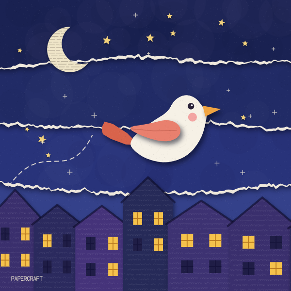 | 0 | Papercraft | torn and cut paper layers under soft shadows | torn edges with white cores, shadowed fills, printed textures | [papercraft.md](papercraft.md) |
| 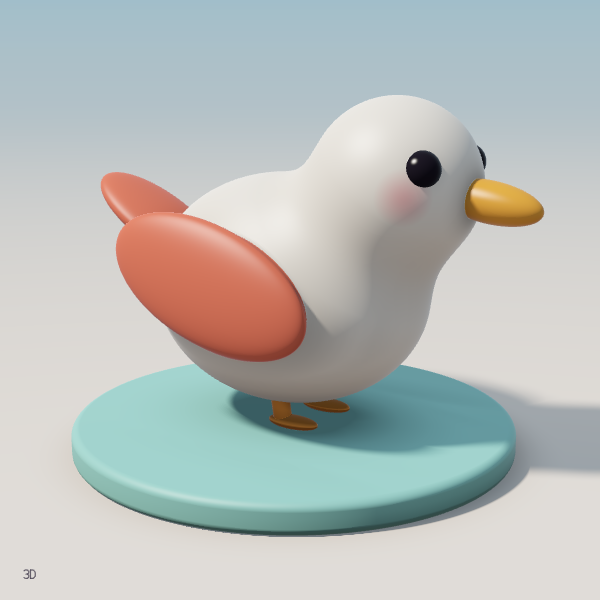 | 1 | 3D render | a lit toy on a pedestal | raymarched signed distances, soft shadows, occlusion, specular | [render-3d.md](render-3d.md) |
| 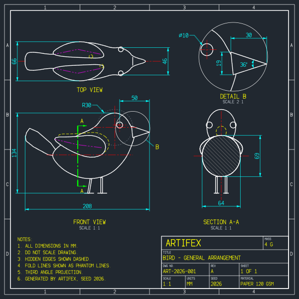 | 2 | CAD drawing | a CAD model-space technical drawing | aligned views, layer colours, dimensions, section, detail | [cad.md](cad.md) |
| 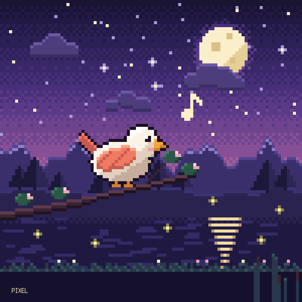 | 3 | Pixel art | a 2D 16-bit scene | grid raster, Bayer dithering, outlined sprites | [pixel-art.md](pixel-art.md) |
| 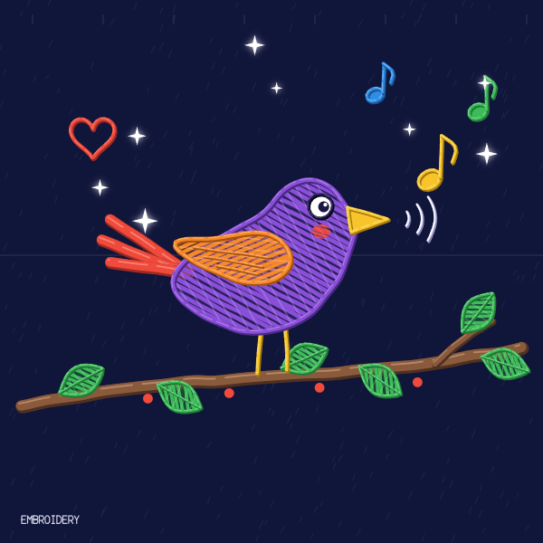 | 4 | Embroidery | thread on dark cloth | satin zigzag fills, strands with an edge and a sheen | [embroidery.md](embroidery.md) |
| 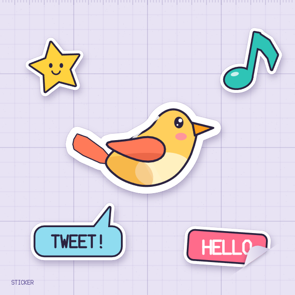 | 5 | Sticker | die-cut vinyl on a cutting mat | one shadowed union stroke, bold outlines, a peel fold | [sticker.md](sticker.md) |
| 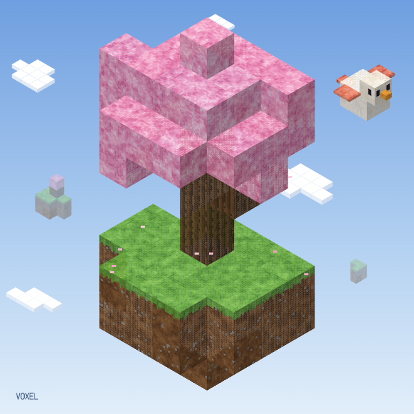 | 6 | Voxel | Minecraft-like blocks | isometric boxes with 16 x 16 texel faces | [voxel.md](voxel.md) |
| 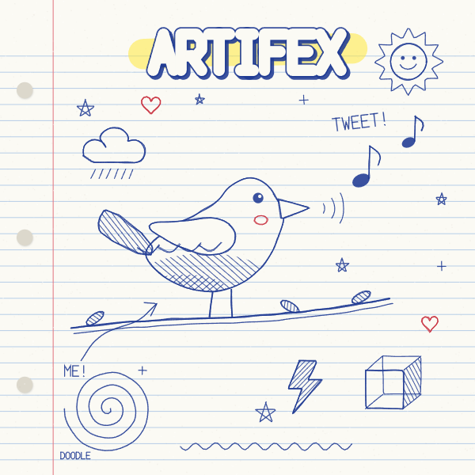 | 7 | Doodle | ballpoint sketches in a notebook | double-pass pen lines, hatching, margin doodles | [doodle.md](doodle.md) |
| 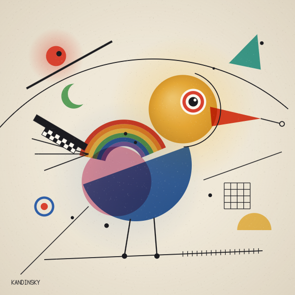 | 8 | Kandinsky | geometric abstraction | halos, rings, arcs, bars, multiply glazes | [kandinsky.md](kandinsky.md) |
| 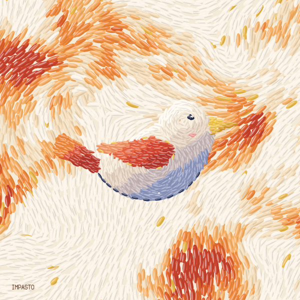 | 9 | Impasto | thick painted dabs | flow-aligned dabs with lit and dark ridges | [impasto.md](impasto.md) |
| 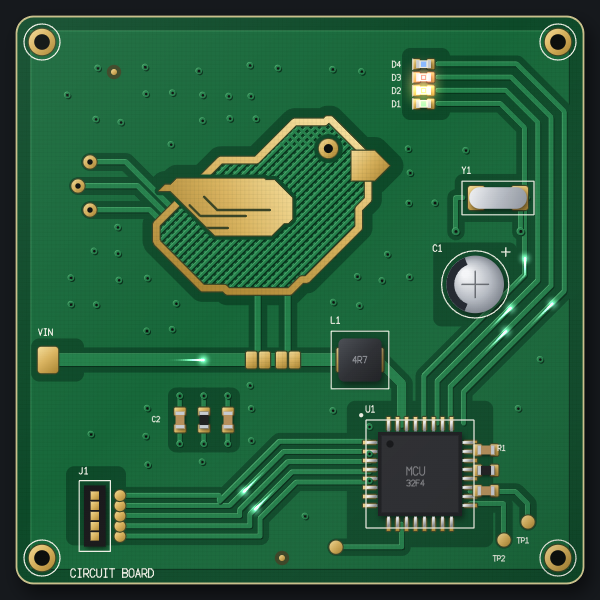 | 10 | Circuit board | a green printed circuit board from above | 45-degree copper under the mask, gold pads, silkscreen, parts | [circuit-board.md](circuit-board.md) |
| 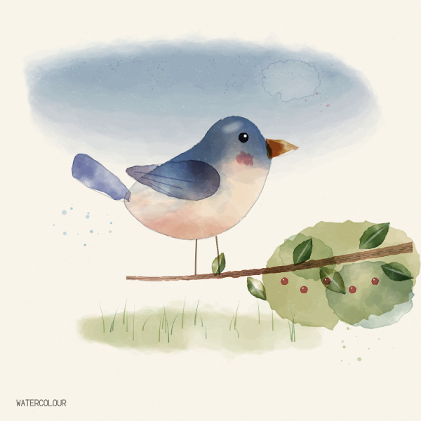 | 11 | Watercolour | transparent washes on paper | layered deformed washes, pooled pigment, dried rims, pencil | [watercolour.md](watercolour.md) |
| 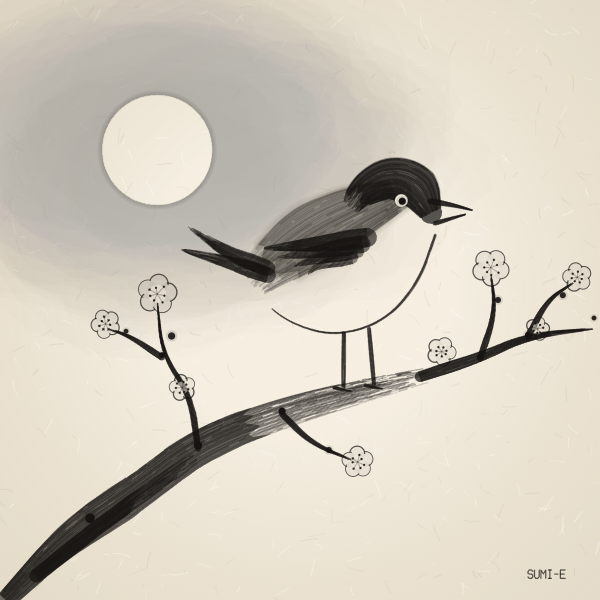 | 12 | Sumi-e | black ink brush painting on rice paper | pressed strokes that run dry, pale washes, reserved white | [sumi-e.md](sumi-e.md) |
| 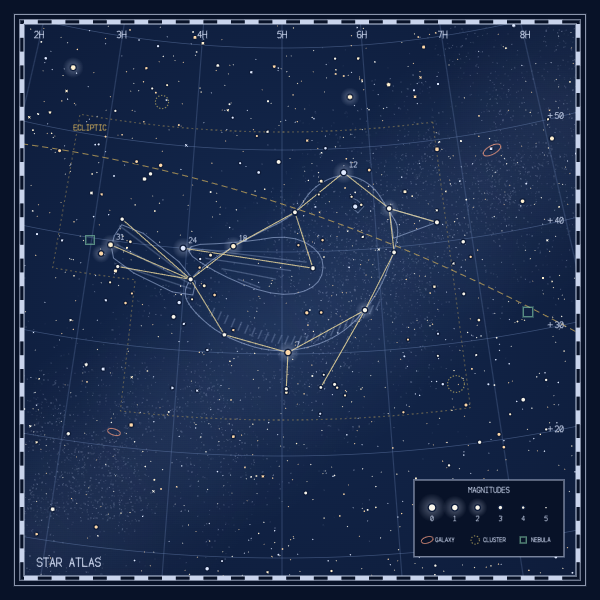 | 13 | Star atlas | a printed celestial chart | projected grid, stars by magnitude, constellation, legend | [star-atlas.md](star-atlas.md) |
| 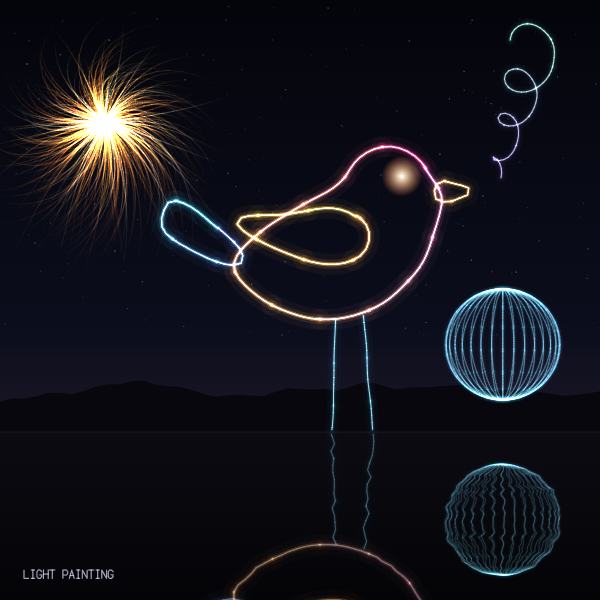 | 14 | Light painting | a long exposure of lights moved at night | additive trails with white cores, sparks, rippled reflection | [light-painting.md](light-painting.md) |

## Installed style packs

Style packs add styles beyond this table, installed in `~/.artifex/styles/`
(or under `ARTIFEX_HOME`). `npm run styles` lists every style by name, built in
and installed, with each pack's version and whether it is trusted; see
[style packs](../../../docs/apis/style-packs.md). A pack's guide and piece take
the place of the guide and module here. For a style in neither, follow
[Named styles](../SKILL.md#named-styles): name its signature, read the nearest
guides and check each part on frames.

## See them

`npm run page -- --style impasto` writes `out/style-impasto-page.html`, and
`npm run seeds -- --style impasto 9 0.5` writes `out/style-impasto-seeds.html`,
for any name `npm run styles` lists. An installed pack draws only once it is
trusted.

From the library root, this writes `skills/artifex/styles/gallery-param-style.html`,
one cell per style:

```shell
npm run seeds -- ./skills/artifex/styles/gallery.cjs 15 1 --param style
```

`npm run page -- ./skills/artifex/styles/gallery.cjs` writes an interactive
`gallery-page.html` with a `style` control. Git ignores both files.

The example images are the gallery drawn at 600 pixels through the page's own
`drawFrame`, the path its PNG buttons use. To redraw one, open
`gallery-page.html` in a browser and run this in its console, changing `style`
and the file name:

```js
const A = __artifex, p = A.piece.validate(A.examples['style-gallery']);
const s = A.piece.solve(p, 2026, { style: 9 }), c = document.createElement('canvas');
c.width = c.height = 600;
A.render.drawFrame(c.getContext('2d'), p, s, 0, { scale: 0.6 });
c.toBlob((b) => Object.assign(document.createElement('a'), { href: URL.createObjectURL(b), download: 'impasto.png' }).click());
```

## Use a style for a new subject

1. Read the style's guide, starting with what makes it read as that style.
2. Copy its module into your piece and keep its helpers, palette and order.
3. Replace the demo subject from [`subject.js`](subject.js) with your own
   outlines, part by part.
4. Render a contact sheet and compare it with the gallery cell before changing
   anything else.

Shared helpers live in [`kit.js`](kit.js). Use its `shadow` for every canvas
shadow: it scales blur and offset by the current transform, which the canvas
does not apply to shadows.
